# Te Cuido 🩺🏡

## Descripción del Proyecto

**Te Cuido** es una plataforma digital orientada al cuidado domiciliario en Colombia, diseñada para conectar familias con cuidadores profesionales certificados de manera segura, rápida y confiable.

La plataforma busca mejorar el acceso a servicios de atención domiciliaria para adultos mayores, pacientes en recuperación y personas con enfermedades crónicas, permitiendo gestionar procesos de validación, contratación, comunicación y pago dentro de un entorno digital seguro.

---

## Problemática

Actualmente, muchas familias enfrentan dificultades para encontrar cuidadores confiables y certificados, lo que genera riesgos en la contratación y limita el acceso oportuno a servicios de cuidado domiciliario de calidad.

---

## Objetivo

Diseñar e implementar una aplicación digital que facilite la conexión entre familias y cuidadores profesionales certificados mediante procesos seguros y eficientes.

---

## Funcionalidades Principales

* 👤 Registro e inicio de sesión
* ✅ Validación de cuidadores
* 📅 Contratación de servicios
* 💬 Comunicación entre usuarios
* 💳 Gestión de pagos
* ⭐ Evaluación del servicio

---

## Metodología

El proyecto se desarrolla utilizando la metodología ágil **Scrum**, organizada en sprints iterativos para el diseño, desarrollo y validación continua del sistema.

---

## Resultados Esperados

* Desarrollo de un MVP funcional
* Validación de la plataforma mediante prueba piloto
* Mejora en el acceso a servicios de cuidado domiciliario
* Generación de confianza entre familias y cuidadores

---

## Impacto

Te Cuido busca aportar al bienestar social y al fortalecimiento del cuidado domiciliario mediante innovación digital, promoviendo servicios de salud más accesibles, seguros y eficientes.

---

## Cargue de la app
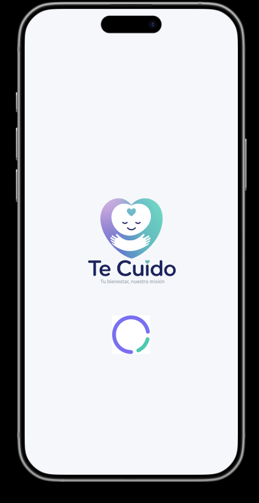

## Inicio
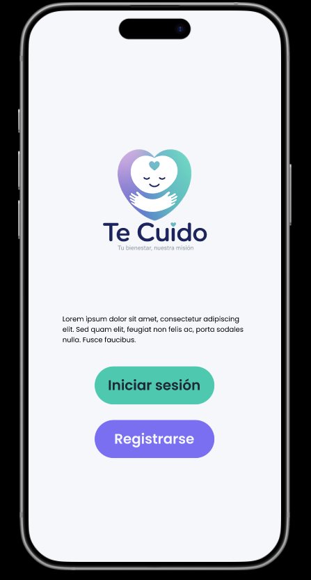

## Login
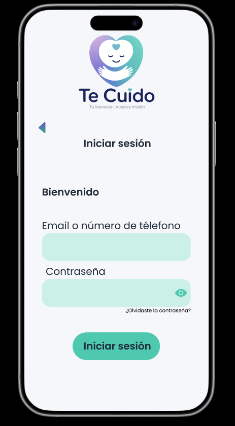

## Registrarse
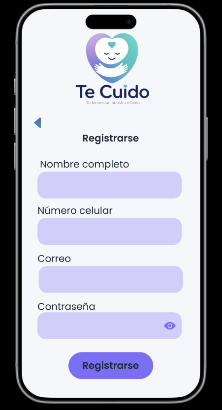

## Restablecer contraseña
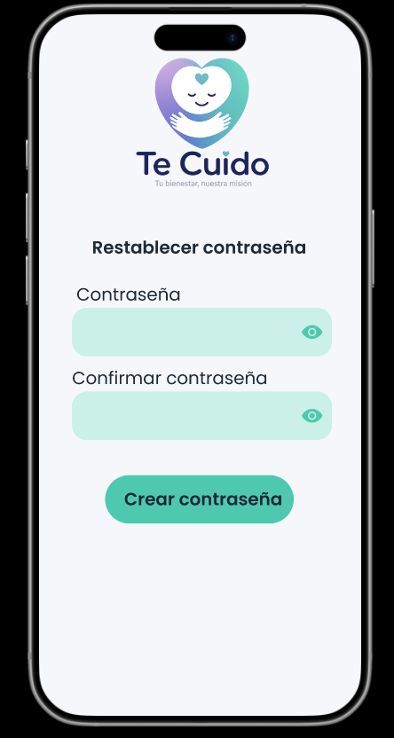

## Home
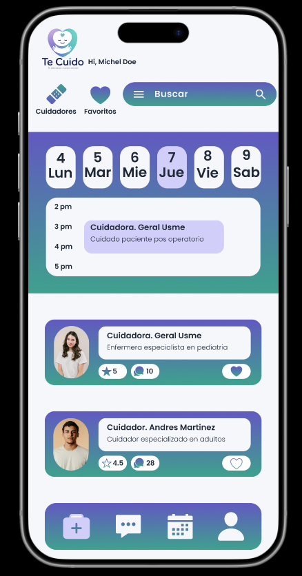

## Chat
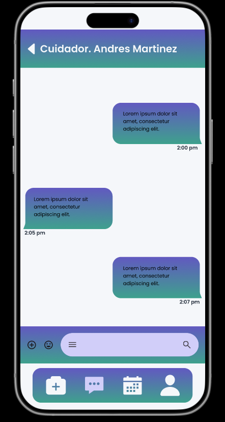

## Calendario
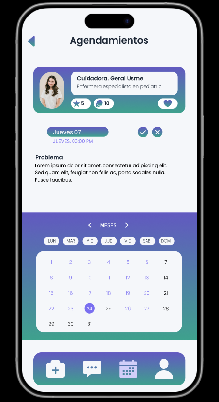

## Perfil
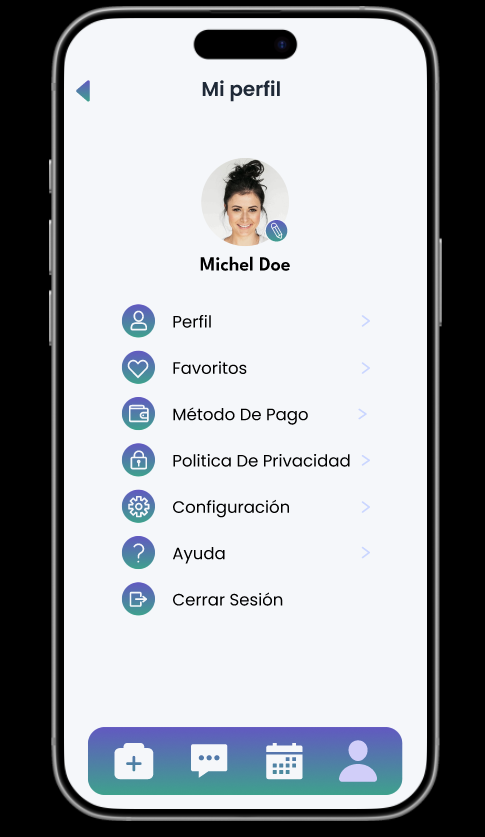

## Buscar cuidadores
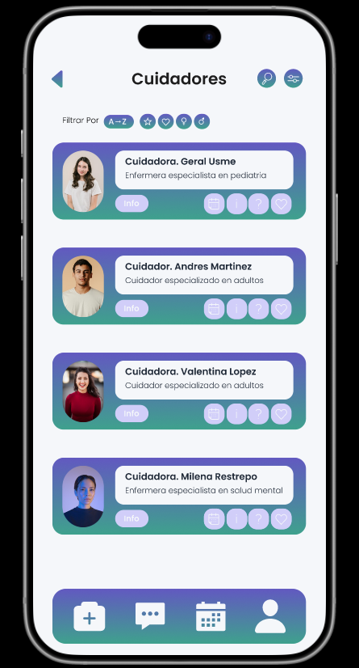

## Favoritos
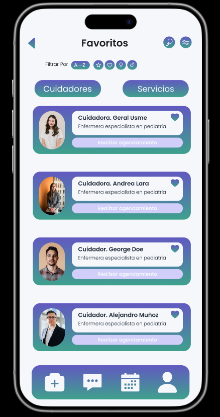
